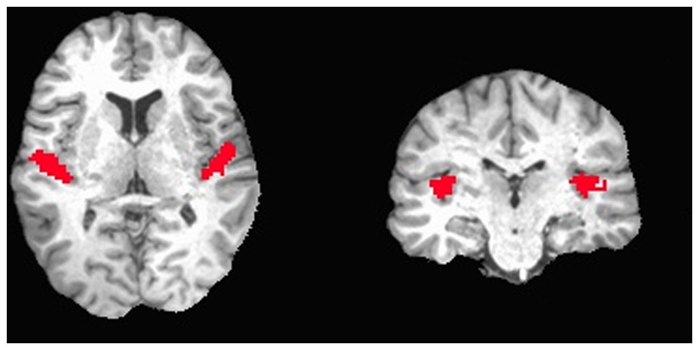

### Recap: what is fMRI?

MRI is an imaging technique, with which we can take scans of muscles, bones, brains,... fMRI is when we repeatedly take MRI scans of the brain.  This allows us to see the brain _in action_ when it's performing tasks etc.

Imagine a subject listening to broadband noise for 15 seconds, and then listening to silence for 15 seconds, and repeat this for 10 times while taking brain scans every 3 seconds.  Afterwards, we can compare the scans during silence with the scans during music, and end up with an image like the following from [Okada et al., 2013](http://journals.plos.org/plosone/article?id=10.1371/journal.pone.0068959).  The brain image in the back is a structural MRI, the red blobs are the parts of the brain that show a significant difference between the two conditions.




In reality, the analysis of the data is much more complex than 'comparing images from two conditions' and there exist thousands of ways to analyse the data.  During this lesson, we will touch a few very basic methods, but a more thorough discussion is outside the scope.  We will assume that all the data is preprocessed, which means that:
- the data are corrected for motion
- the data are corrected for distortions
- the data from different subjects are aligned to a common template
- ...

### Reading and visualising fMRI data with R/neuroconductor.

After opening RStudio, we want to set our working directory to the directory we created during set up, where we can find the data:
```{r setup}
knitr::opts_knit$set(root.dir = "/Users/Joke/Documents/Onderzoek/Presentations/2017_BMSANed-Leiden/shortcourse/CNP_rest/")
```

```{r eval=FALSE}
setwd("~/Desktop/fmri-validation")
```

Neuroconductor is an open-source platform for analysing neuroimaging (and other) data.  It hosts multiple packages to analyse data using different software.  We will mostly use its  base library `neurobase`. To install, run:

```{r eval=FALSE}
source("https://neuroconductor.org/neurocLite.R")
neuro_install("neurobase", release = "stable")
```


The data is located in the directory `data` in the working directory.  Now we can load the data into R using the function `readnii`.

```{r}
library(neurobase)
basedir =
sub70083 <- readnii("sub-10159_task-rest_bold_space-MNI152NLin2009cAsym_preproc.nii.gz")
```

The function `readnii` requires one argument: the name of the file we want to read.  This needs to be character string, which is why we put it in quotes.  We saved the data to the variable `sub70083`.  What comes out is an object of type `oro.nifti`.  Essentially, it is a 4D array, with extra metadata specific to fMRI data.  We can therefore apply functions that we can apply to `arrays`.  Let's look for example at the shape of our data.

```{r}
dim(sub70083)
```

This shows us that the first three dimensions are `65 x 77 x 49`.  These correspond to the x-, y- and z-coordinates of the brain.  The fourth dimension is time, which means there are 152 time points measured.

We can also run a function from `neurobase` that only works on this type of object:

```{r}
check_nifti(sub70083)
```

This shows some information that is stored in the "header" of the file.  For example, it tells us the pixel dimensions.  The first three numbers tell us the size of the voxels in space: 3 x 3 x 4 cm.  The last number tells us the dimension in time: a scan was taken every 2 seconds.

Another interesting function is the visualisation of nifti's:

```{r}
orthographic(sub70083)
```

Note that we only visualise one timepoint, the first one.  R will automatically show the first timepoint.

If you're not sure about how to use a certain function, you can call for help:
```{r eval=FALSE}
?orthographic
```

You will see that there are many more arguments that can be passed to the function `orthographic`.  For example the argument `xyz` allows us to specify where to draw the cross-hairs.  Let's try the following:

```{r}
orthographic(sub70083,xyz=c(20,20,30))
```

To look at the `value` of one specific point in time and space, we can use indexes.  Remember our cross-hair in the figure was at the first timepoint at coordinates (20,20,30).  
The following example shows the exact value of this point in the figure at the first timepoint.

```{r}
sub70083[20,20,30,1]
```

This shows that the value at the coordinates (20,20,30) at the first timepoint in the matrix os 1000.697.  The units of the data are a derivative of how much oxygen is in the blood, so in itself pretty meaningless.  Especially when you know that during preprocessing, the average is set to 1000.  What is more interesting is to look at how the value changes over time, which we can do by omitting the index in the 4th dimension:

```{r}
sub70083[20,20,30,]
```

If we plot this vector, we can see how the measured signal in this voxel changes over time.

```{r}
plot(sub70083[20,20,30,],type='l')
```

> ## Exercises
> Now that we know how to read, inspect and visualise fMRI data, it's time for some exercises !
> In the data-folder, there is for each subject 3 nifti-images:
> - mask: sub-XXXXX_task-rest_bold_space-MNI152NLin2009cAsym_brainmask.nii.gz
> - rest: sub-XXXXX_task-rest_bold_space-MNI152NLin2009cAsym_preproc.nii.gz
> - anatomical: sub-XXXXX_T1w_preproc.nii.gz
>
> We have looked at the functional rest data.  Now look at the anatomical scan yourself.
> - Read in the anatomical data.
> - What are the dimensions of the anatomical data?  Compare with the dimensions of the rest scan.
> - Visualise the data.
> - Set the color of the cross-hairs to `blue`
> - Look at what the function `double_ortho` does, and use it to plot the rest scan (the first timepoint) and the anatomical scan.
